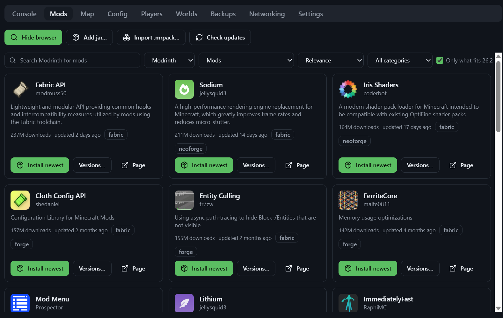
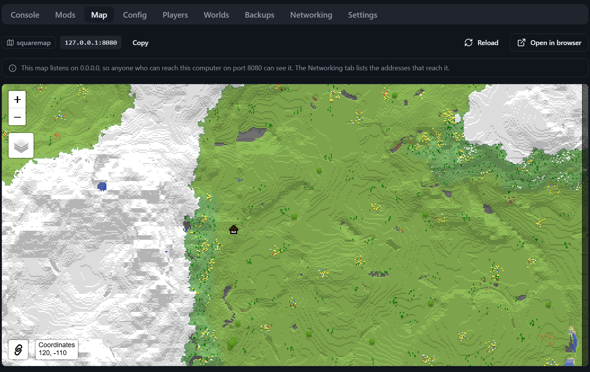

# Minecraft Server Manager

A desktop app for running Minecraft servers on your own computer. It downloads the server
files, starts and stops them, shows the console, installs mods and plugins, and keeps
backups — for as many servers as you like, side by side.

Windows and Linux are both first-class. Nothing is uploaded anywhere: every server, world
and backup stays on your machine.

## What it looks like

| | |
| --- | --- |
|  |  |
| Your servers down the side, the console live in the middle. | Mods and plugins from Modrinth and CurseForge, with the version actually chosen rather than guessed. |



The world in a browser, served by the server itself.

---

## For people who just want to run a server

### 1. Java, which you may not have to install

A Minecraft server is a Java program, and which Java it needs depends on its Minecraft
version: 26.x wants Java 25, 1.20.5 and later want 21, 1.17 and later want 17, and older
servers want Java 8. The app works that out per server, finds every Java already on the
computer, and offers to download the right one when nothing suitable is there — naming the
version and the download size before it fetches anything.

So you can skip this step. If you would rather install it yourself:

- **Any platform:** [Adoptium Temurin](https://adoptium.net/temurin/releases/) — pick the
  **JDK**, not the JRE.
- **Debian / Ubuntu:** `sudo apt install openjdk-21-jdk`
- **Fedora:** `sudo dnf install java-21-openjdk`

One thing worth knowing: a 32-bit Java cannot run a server with more than about 1.5 GB of
memory. The app will not choose one, and says why rather than letting the server fail.

### 2. Install the app

Download the installer for your system from the
[Releases page](https://github.com/MeatyMarky/mc-server-manager/releases):

| System | File | Notes |
| --- | --- | --- |
| Windows | `.msi` or `.exe` (NSIS) | Either works. The `.msi` suits managed machines. |
| Debian, Ubuntu, Mint | `.deb` | `sudo apt install ./Minecraft*.deb` |
| Other Linux | `.AppImage` | `chmod +x Minecraft*.AppImage`, then run it. |

The builds are **not code-signed**. Windows SmartScreen will warn you the first time:
choose **More info → Run anyway**. See
[docs/troubleshooting.md](docs/troubleshooting.md#windows-says-the-app-is-unrecognised) for
what signing would involve.

### 3. Create your first server

1. Open the app. It looks for Java in the background and tells you what it found.
2. Click **Create a server**.
3. Choose a name, a folder, and a type:
   - **Vanilla** — exactly what Mojang ships.
   - **Paper** / **Purpur** — much faster, and they take **plugins**.
   - **Fabric** / **Forge** / **NeoForge** — they take **mods**.
   If you are unsure, pick Paper.
4. Pick a Minecraft version from the table. It lists every version that type offers with
   the date it came out, newest first — tick **Snapshots** or **Pre-releases** if you want
   those too. The **Build** dropdown underneath is filled in once you have chosen; leave it
   on "Newest" unless you need a particular one.
5. Wait for the download to finish.
6. Open the **Settings** tab and **accept the Minecraft EULA**. The app never accepts it
   for you — a server refuses to start until you do.
7. Press **Start**.

The **Console** tab shows the server's output live. Type commands into the box at the
bottom, exactly as you would in a terminal.

### 4. Let people in

The **Networking** tab answers this for your machine specifically:

- Every address this computer has, with a **Copy** button and a line saying who each one
  works for — the people in your house, whoever is on the same Radmin/Hamachi/Tailscale
  network, or the internet.
- Your **public address**, hidden until you press Show, and a **check from outside** that
  says whether the port is really open. If that check cannot be completed it says so,
  rather than claiming the port is shut.
- A button that asks the router to forward the port over **UPnP**, and — for the many
  routers that will not — the manual steps, written out with your own router's address.
- Whether the **whitelist** is on, and a button to turn it on while the server is stopped.

### A map of your world

Tick **Web map** when creating a server and it installs [squaremap](https://modrinth.com/mod/squaremap)
alongside it: flat, vanilla-looking tiles you can pan around in a browser. It gets its own
**Map** tab, on a port nothing else on the machine is using.

Two things worth knowing. It draws the world as people explore and save it, so a new world
looks mostly empty at first — the tab says so, and offers a button that renders what has
already been played. And its web server listens on every address this computer has, so anyone
who can reach the machine can see the map; the Networking tab lists exactly which addresses
those are.

**Players**, **Worlds**, **Config** and **Backups** each have their own tab. App-wide
options — theme, the folder new servers go in, downloaded Java, the CurseForge key — are
behind the **gear** in the top right.

### Where your files live

The **About** dialog (the ⓘ button, top right) shows the exact paths on your machine,
with a button to open each one:

| What | Windows | Linux |
| --- | --- | --- |
| App data, database, logs | `%APPDATA%\dev.msm.manager` | `~/.local/share/dev.msm.manager` |
| Servers | wherever you chose when creating them | same |
| Backups | `<app data>/backups/<server id>/` | same |

### When something goes wrong

Every error in the app is written in plain language, with a **Details** expander holding
the technical text. [docs/troubleshooting.md](docs/troubleshooting.md) covers the common
ones.

If you need to report a bug, use the **?** button in the top-right corner. It builds a zip
with the app log, your Java setup and the server's console — and **shows you every line
before writing it**, so you can check what you are about to share. The app never sends
anything anywhere itself.

---

## For developers

### Stack

Tauri v2 (Rust backend, system webview), React + TypeScript + Vite, Tailwind + shadcn/ui,
tokio, sqlx + SQLite. Package manager: pnpm. **No Electron.**

All process, filesystem and network work lives in Rust; the frontend calls Tauri commands
and subscribes to events, and never polls. `CLAUDE.md` documents the conventions and the
domain rules that must not be "simplified away".

### Build from source

Prerequisites: Rust (stable), Node 24+, pnpm 11+. On Linux also:

```bash
sudo apt install libwebkit2gtk-4.1-dev libappindicator3-dev librsvg2-dev patchelf
```

```bash
pnpm install
pnpm tauri dev
```

Installers for the current platform:

```bash
pnpm tauri build
```

### Tests

```bash
cargo test           # in src-tauri/, no network
pnpm test            # vitest
pnpm typecheck
cargo clippy --all-targets -- -D warnings
```

Provider tests run against recorded fixtures. Re-record them with `cargo xtask
refresh-fixtures` when an upstream API retires a build — stale fixtures are maintenance,
not a break. Live checks are `#[ignore]`d:

```bash
cargo test --test network_smoke -- --ignored --nocapture
```

### Releasing

Bump `version` in `src-tauri/Cargo.toml` — that is the only place it lives, and Tauri reads
it from there — then tag the commit `vX.Y.Z` and push. `.github/workflows/release.yml`
checks the tag against the crate version, builds MSI, NSIS, `.deb` and AppImage, and drafts
a GitHub release with the artefacts attached. The commit SHA is stamped into the binary by
`build.rs` and shown in the About dialog.

---

Not affiliated with Mojang or Microsoft. Minecraft is a trademark of Mojang Synergies AB.
